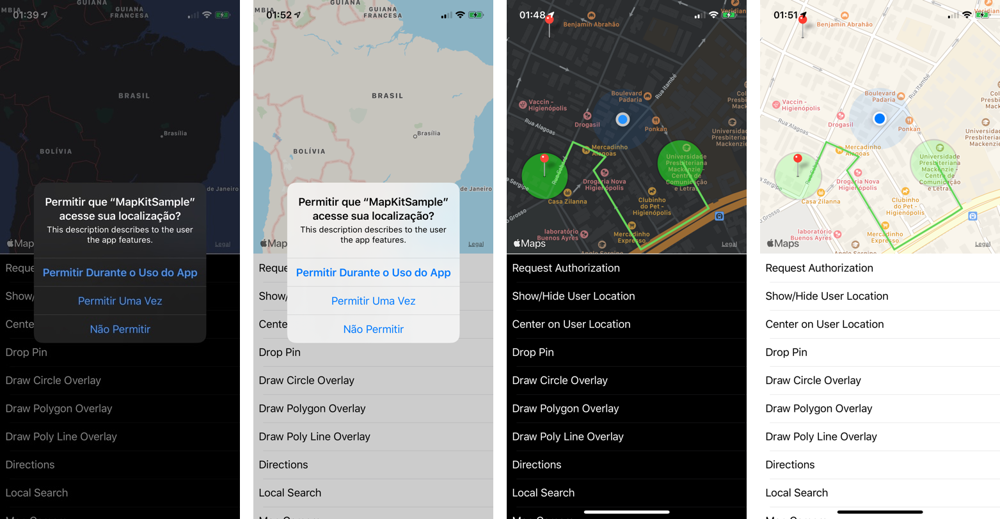

# Aula sobre iOS MapKit

Este material tem como objetivo ser suporte para as aulas de iOS MapKit, por isso sua estrutura de código não respeita princípios como coesão e acoplamento, nem segue corretamente o padrão de projeto MVC.

Recomenda-se que o aluno sempre recorra a documentação oficial, com objetivo de conhecer em detalhes o que cada objeto e métodos fazem, bem como descobrir novos recursos.

Notas de aula: [aula.key](aula_iOS-MapKit.key) / [aula.pdf](aula_iOS-MapKit.pdf)

[Documentação sobre MapKit](https://developer.apple.com/documentation/mapkit)

[Documentação sobre CoreLocation](https://developer.apple.com/reference/corelocation)

## Desafios

### Bronze

Desenvolver um aplicativo no qual o usuário toca em um local do mapa e uma rota é criada entre a localização atual e o ponto selecionado do mapa.

### Prata

Desenvolver um aplicativo para que um usuário possa armazenar localizações de interesse e possa salvar anotações sobre ele. Estas localizações salvas devem ser mostradas no mapa e, ao serem tocada exibem as anotações que o usuário fez.

### Ouro

Que tal fazer os desafios bronze e prata, mas utilizando SwiftUI? Faça também uma reflexão sobre quais são suas impressões sobre a mudança de framework.

> [license MIT](LICENSE_MIT.md) - [license CC](LICENSE_CC-BY-NC-ND.md)
